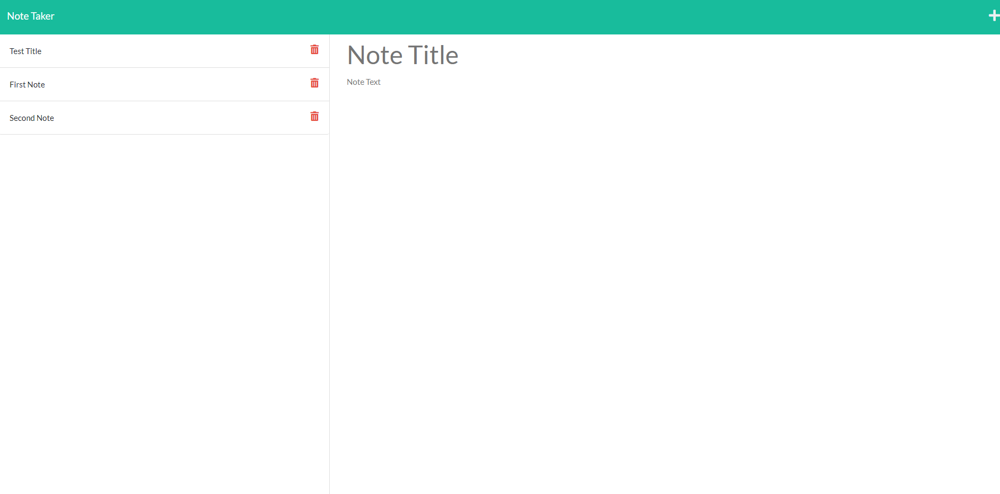
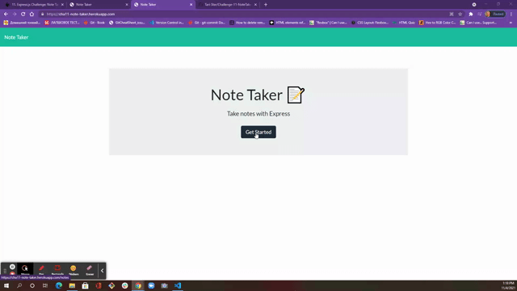

# Challenge-11-NoteTaker

## Description:

This is a simle Note Taker application that allows users to add, view saved notes and posibly delete the notes(still working on `delete` function). This application uses an express backend and save and retrieve note data from a JSON file.

##  Table of Contents

* [Demo](#demo)
* [Technology](#technology)
* [Usage](#usage)
* [License](#license)
* [Questions](#questions)

## Demo: 

* Screenshot: 

* GIF: 

* Deployed link:  [https://cha11-note-taker.herokuapp.com](https://cha11-note-taker.herokuapp.com/notes)

* Repository link: [https://github.com/Tari-Star/Challenge-11-NoteTaker.git](https://github.com/Tari-Star/Challenge-11-NoteTaker.git)

## Technology ( Links ):

**1. [Express.js](https://expressjs.com/)** :

* Web Applications : Express is a minimal and flexible Node.js web application framework that provides a robust set of features for web and mobile applications.

* APIs : With a myriad of HTTP utility methods and middleware, creating a robust API is quick and easy.

* Performance : Express provides a thin layer of fundamental web application features, without obscuring Node.js features.

**2. [Node.js](https://nodejs.org/en/)** : 

* Node.js is an open-source and cross-platform JavaScript runtime environment. 

* A Node.js app is run in a single process, without creating a new thread for every request. 

* Node.js provides a set of asynchronous I/O primitives in its standard library that prevent JavaScript code from blocking.

**3. [UUID](https://www.npmjs.com/package/uuid)** : The uuid (Universal Unique Identifier) creates random unique id's.

**4. [Util](https://www.npmjs.com/package/util)** : The Util module provides access to some utility functions.

**5. [Heroku](https://www.heroku.com/)**: Heroku is a container-based cloud Platform as a Service (PaaS). Developers use Heroku to deploy, manage, and scale modern apps.

## Usage:

> To install necessary dependencies, run the following command in your terminal:
* Clone repository to use this application on your local machine.
* To install *node.js*, run  `npm init`.
* To install *express*, run `npm i express`.
* To install *uuid*, run `npm i uuid`.
* To install *util*, run `npm i util`.
* To deploy on *heroku*, run `heroku create <app-name>`.

* The application will be invoked with `node server.js`. This will start localhost server on PORT 3001.

* Open browser and type `http://localhost:3001/` to run this application on your local machine.

 ## License

    
  > This project is licensed under the [MIT license](https://choosealicense.com/licenses/mit) 
    
    
  
   ---
   
  ## Questions?

   
  
  
  For any questions about the repo, please contact me with the information below:
  
 > To open an issue:
 
 GitHub/Issues: [@Tari-Star](https://github.com/Tari-Star/Challenge-11-NoteTaker/issues)
 > Contact me directly:
  
 Email: [Gmail](mailto:tari.star.g@gmail.com)